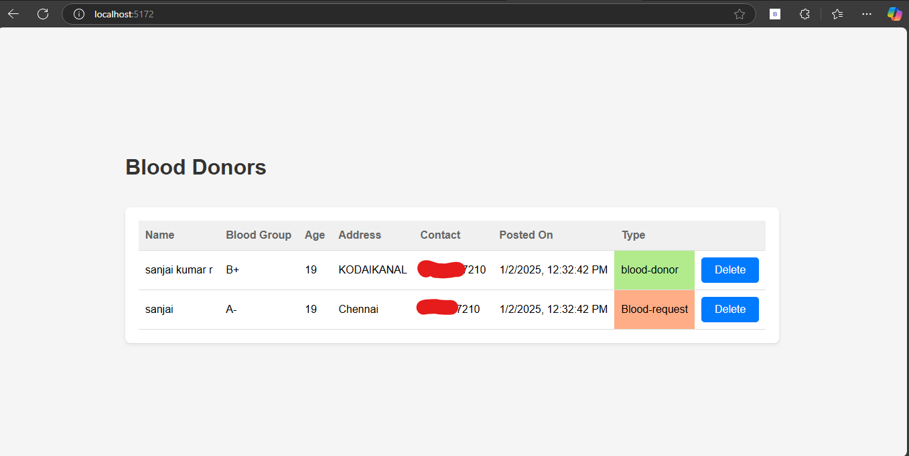

# Blood Bridge

## Overview

**Blood Bridge** is a web application designed to connect blood donors and recipients. The platform provides a way for users to post blood donation requests and find suitable donors. It includes features like viewing donor/recipient details, notification of upcoming blood donation camps, and points-based rewards for donors.

## Features

- **Donor & Recipient Management**: Users can post requests for blood donation or volunteer to donate blood.
- **Real-time Notifications**: Donors are notified about upcoming blood donation camps and urgent requests.
- **Points System**: Donors are awarded points and benefits based on their contributions.
- **Responsive Design**: The application is mobile-friendly with a clean UI built using Tailwind CSS.

## Tech Stack

- **Frontend**: React, Tailwind CSS
- **Backend**: Node.js, Express.js
- **Database**: MongoDB (with Mongoose)

## Future Development
1. Implement JWT
2. Enhance UI
3. Resove bug while exiting the page


## Installation and Setup

1. **Clone the repository**

   ```bash
   git clone https://github.com/your-username/blood-bridge.git
   cd blood-bridge

## Demo Screenshots

Below are some screenshots showcasing the application's functionality:

### Home Page  View


### Login Form


### Home Page


### New Requests


### Adding Request Details


### Deleting a Request


### Admin DashBoard 


---


## License

This project is licensed under the [MIT License](LICENSE).  
You are free to use, modify, and distribute this project under the terms of the license.

---

## Contributing

We welcome contributions to enhance the application! To contribute:

1. **Fork the repository:**  
   Click the "Fork" button on the top-right corner of this repository.

2. **Clone the repository:**  
   ```bash
   git clone https://github.com/<your-username>/bloodbridge.git
   cd bloodbridge
